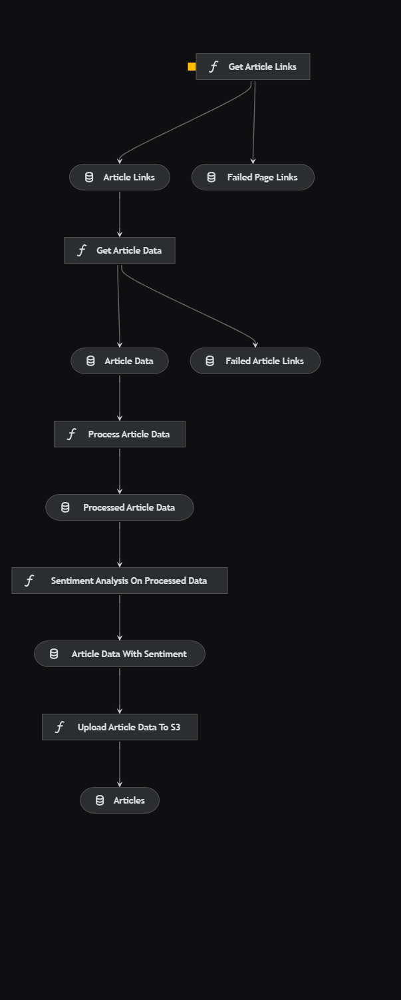

# Data-Pipeline-for-Portfolio-Management
`short-term_trading_signals`

`portfolio_management`

 `risk_management`

 `market_impact_assessment`
## Project Overview

This is a robust data engineering solution focused on streamlining the collection, transformation, and analysis of financial data specific to gold as a commodity. This project aims to empower investment portfolio managers with timely and accurate insights for making informed decisions in the world of precious metals investments, gold against the us dollar.
## Architecture

### Pipelines in detail
The news data pipeline
1. Scrapes news articles from a website.
2. Performs sentiment analysis on the articles.
3. Uploads the resulting datasets to AWS S3.

## License

This project is licensed under the MIT License - see the [LICENSE](LICENSE) file for details.
