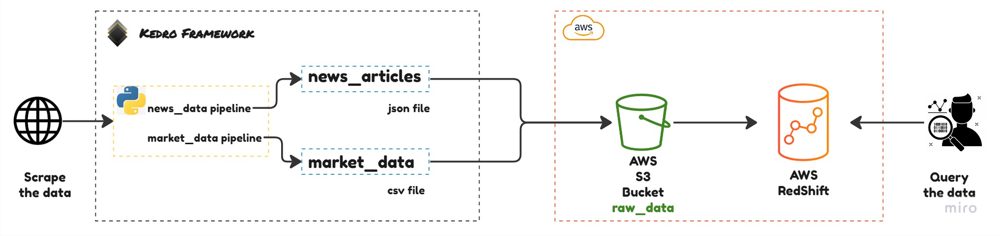
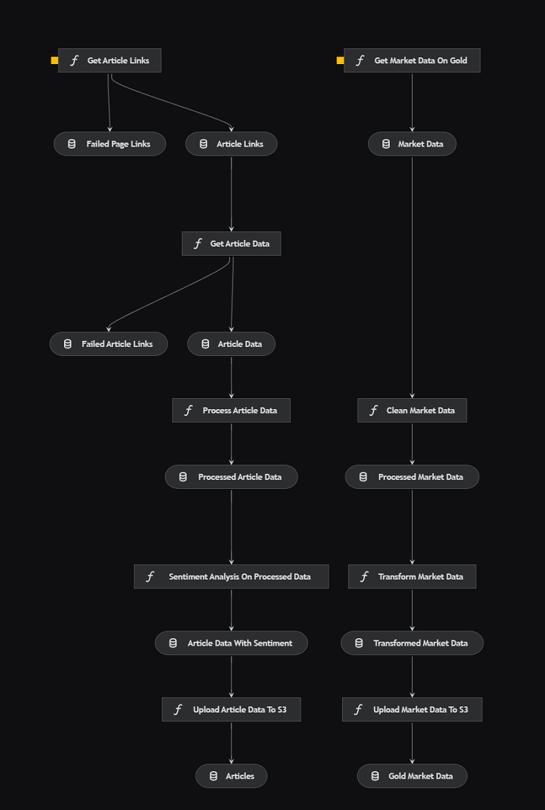
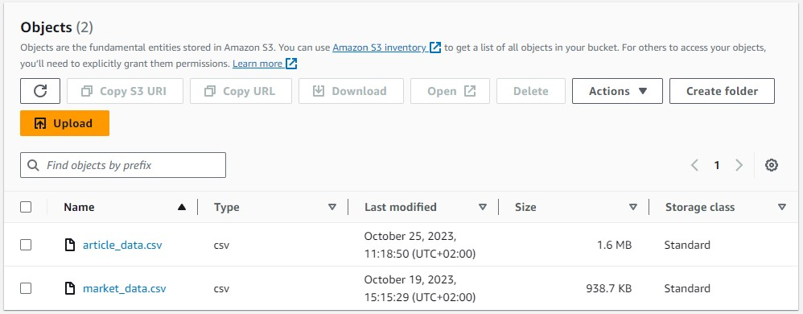

# Data-Pipeline-for-Portfolio-Management
## Project Overview

This is a robust data engineering solution focused on streamlining the collection, transformation, and analysis of financial data specific to gold as a commodity. This project aims to empower investment portfolio managers with timely and accurate insights for making informed decisions in the world of precious metals investments, gold against the us dollar.

What I learned
- handling market data (ohlc)
- web scraping using python
- sentiment analysis using LLMs
- text summarization

## Architecture


### Pipelines in detail
The news data pipeline
1. Scrapes news articles from a website.
2. Performs sentiment analysis on the articles.
3. Uploads the resulting datasets to AWS S3.

The market data pipeline
1. Scrapes ohlc market data via the twelvedata api.
2. Adds a new column based on the difference between the open price and close price.

3. Uploads the resulting datasets to AWS S3.



### Results after runnning pipeline



## Usage
### Prequisites
- [Docker](https://www.docker.com/get-started/) installed on your pc
- Knowledge of [python](https://www.python.org/about/gettingstarted/)

To get these pipelines up and running you have to run the following command:
```
kedro run
```

To learn how to set up a kedro project visit https://docs.kedro.org/en/stable/get_started/install.html
 
## License

This project is licensed under the MIT License - see the [LICENSE](LICENSE) file for details.
